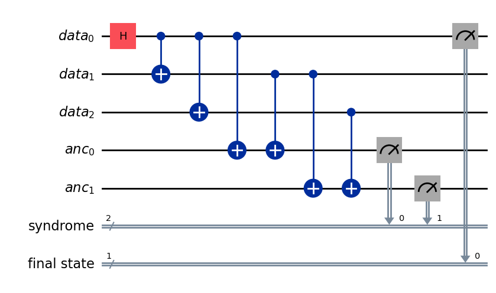

# THREE QUBIT BIT-FLIP Project

## A three qubit bit-flip exercise to practice simple error suppression for different noise models

Three Qubit Bit-Flip code 

The code works as follows:

* Creates 3 data cubits, 2 ancilla qubits, 2 classical bits
* Places 1 data cubit into superposition state using H gate
* Applies CNOT to other 2 data cubits to build a 3 qubit bell state 1/sqrt(2) (|000> + |111>)
* Applies CNOT to each ancilla with data qubit pairs to store combined parity in entangled ancilla
* Measures ancillas to classical bits for error syndrome and corrects corresponding qubit via X, CNOT, and CCNOT gates
* Measures final output state counts (ideal is 1:1 <-> |000>:|111>)
* Simulates noise models for IBM Brisbane and a custom model for 10% bit-flip chance at each gate
* Evaluates quantum circuit simulation with selected noise model

## Outputs
" (Final State) (error syndrome) " : count

* Final state = measured |0> or |1>
* error syndrome =
          00 (no error),
          01 (qubit 0 error), 
          10 (qubit 2 error), 
          11 (qubit 1 error)

## How error models are applied
The error model simulating IBM Brisbane, along with the basis gates and coupling map, is passed into the Aer backend (which is why the error messages can be ignored as we want to override the Aer base backend)

The operators representing 10% bitflip at each gate added to an error model which is applied to the Aer backend

## Required Libraries in requirements.txt
* numpy==2.2.4
* qiskit==2.0.0
* qiskit_aer==0.17.0
* qiskit_ibm_runtime==0.38.0

## How to run this project in your environment

1. clone this project:
    'git clone https://github.com/DOWingard/ThreeQubitBitFlip.git'
2. pip install -r requirements.txt
3. (OPTIONAL) Set up IBM account and run the commented lines for linking with API key if you want to use the IBM Brisbane noise model
4. import and run function run_qc from ThreeQubitBitFlip.py 

